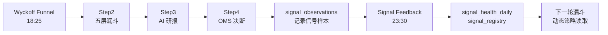
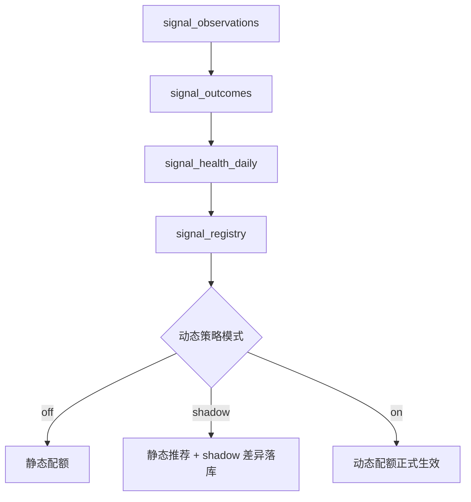

# 系统架构总览

WyckoffAgent 有两种运行模式：**定时管线**（自动跑，无人值守）和 **交互 Agent**（用户对话触发）。

---

## 1. 定时管线（GitHub Actions）

每天自动执行的批处理流水线，由 `scripts/daily_job.py` 串联：

```text
Step2（全市场筛选）→ Step2.5（信号确认）→ Step3（AI 研报）→ Step4（持仓决断）
```



### Step2：Wyckoff 漏斗

- 入口：`core/funnel_pipeline.py`
- 核心引擎：`core/wyckoff_engine.py`（纯计算，不做网络请求）
- 五层筛选：L1 基础过滤 → L2 六通道强弱 → L3 板块共振 → L4 威科夫触发 → L5 退出信号
- 结果推送飞书

### Step2.5：信号确认

- L4 触发信号需经 1-3 天价格确认后才进入操作池
- 防止“假信号”直接触发买入

### Step3：AI 批量研报

- 入口：`core/batch_report.py`（daily_job 调用）/ `scripts/step3_batch_report.py`（独立运行）
- 将候选股的结构化特征切片喂给大模型
- 输出三阵营分类：逻辑破产 / 储备营地 / 起跳板
- RAG 防雷：命中负面新闻可一票否决

### Step4：持仓决断

- 入口：`core/strategy.py`（daily_job 调用）/ `scripts/step4_rebalancer.py`（独立运行）
- 读取账户状态
- 综合研报 + 持仓 + 风控，输出 EXIT/TRIM/HOLD/PROBE/ATTACK 指令
- 推送到 Telegram

### Signal Feedback：信号反馈闭环

- 入口：`scripts/signal_feedback_job.py`
- 时间：北京时间周一到周五 23:30
- 读取 `signal_observations`，计算 1/3/5/10/20 日收益和回撤
- 写入 `signal_outcomes`、`signal_health_daily`、`signal_registry`
- 下一轮漏斗按 `FUNNEL_DYNAMIC_POLICY=off|shadow|on` 决定是否使用动态策略



### 其他定时任务

| 任务 | 功能 |
|------|------|
| 盘前风控 | A50 + VIX 监测，四档预警 |
| 尾盘策略 | 规则打分 + LLM 复判，筛选尾盘买入 |
| 形态复盘重定价 | 同步收盘价，计算累计收益 |
| 信号反馈闭环 | 盘后验收 L4 信号表现，更新动态策略状态 |
| 回测网格 | 18 组参数并行回测 |
| 港股 / 美股漏斗 | 独立 universe + TickFlow 批量日线扫描 |

---

## 2. 交互 Agent（三条栈 + 维护入口）

用户通过自然语言与系统对话，Agent 自主决定调用哪些工具。

### CLI / TUI 栈（功能最全）

- 入口：`cli/__main__.py`
- UI：`cli/tui.py`（全屏终端界面）
- Agent Loop：`cli/agent.py`
- Provider：`cli/providers/`（OpenAI-compatible，支持多模型切换和 fallback）
- 工具：10 个金融工具 + 4 个通用工具（执行命令、读写文件、抓取网页）
- 特有能力：后台任务、分层 Agent 记忆（L1 原子 / L2 场景 / L3 画像）、上下文压缩、Skills 扩展

### React Web 栈（主力 Web 端）

- 前端：`web/apps/web/`
- Agent：`web/apps/web/src/lib/chat-agent.ts`
- 运行时：Vercel AI SDK `generateText`（`maxSteps=10` 多轮工具调用）
- 边缘代理：Cloudflare Pages Functions
- 工具：10 个金融工具（不含命令执行等本地工具）

### MCP Server 栈

- 入口：`mcp_server.py`
- 协议：FastMCP / stdio
- 定位：给 Claude Code、Cursor 等外部 Agent 暴露 Wyckoff 工具
- 注意：MCP 只提供单次工具调用，不负责多轮对话编排

### 三栈共用的工具

定义在 `agents/chat_tools.py`，导出 10 个金融工具：

| 工具 | 能力 |
|------|------|
| `search_stock_by_name` | 模糊搜索股票 |
| `analyze_stock` | 单股诊断 / 行情查询 |
| `portfolio` | 查看持仓 / 批量健康扫描 |
| `update_portfolio` | 增删改持仓 |
| `get_market_overview` | 大盘水温 |
| `screen_stocks` | 五层漏斗筛选 |
| `generate_ai_report` | AI 研报 |
| `generate_strategy_decision` | 持仓决策 |
| `query_history` | 查历史推荐/信号/尾盘记录 |
| `run_backtest` | 回测 |

CLI 栈额外提供：`exec_command`、`read_file`、`write_file`、`web_fetch`。

---

## 3. 数据流

```text
行情数据源 → Supabase 缓存 → 引擎计算 → 结果存储 → 推送通知
            ↗ A 股：tickflow → tushare → akshare → baostock → efinance（自动降级）
            ↗ 港股 / 美股：TickFlow + 本地 universe
```

- 优先读 Supabase 缓存
- 缺口只补拉缺失日期
- 补拉后回写缓存
- 行情缓存保留约 320 个交易日窗口
- `data/market_universes/*.json` 维护 A 股 / 港股 / 美股 / ETF 的代码、名称和搜索元数据

---

## 4. 关键设计原则

| 原则 | 体现 |
|------|------|
| 计算与 IO 分离 | `wyckoff_engine.py` 不做任何网络请求，只接受 DataFrame |
| 容错降级 | 数据源链式降级、RAG 失败不阻断主流程、合规简报降级为模板 |
| 快照可复现 | 行情落盘为 snapshot，回测全程离线回放 |
| Loop 约束模型 | 即使模型不调用工具，loop guard 也会强制纠偏（详见第 10 篇） |

更完整的当前架构事实源见 [docs/ARCHITECTURE.md](../ARCHITECTURE.md)。
